# Webapp06: GlobalMart

## Desarrolladores

Este proyecto ha sido desarrollado por los siguientes colaboradores:
- **Luis Abril Andreu** - [l.abril.2022@alumnos.urjc.es](mailto:l.abril.2022@alumnos.urjc.es) - [GitHub](https://github.com/LuisAbril)
- **Cristian Teijeiro Parga** - [c.teijeiro.2022@alumnos.urjc.es](mailto:c.teijeiro.2022@alumnos.urjc.es) - [GitHub](https://github.com/teijeiro7)
- **Juan Manuel Bustos Moya** - [jm.bustos.2022@alumnos.urjc.es](mailto:jm.bustos.2022@alumnos.urjc.es) - [GitHub](https://github.com/juanmabm73)
- **Álvaro Pindado Castiñeira** - [a.pindado.2019@alumnos.urjc.es](mailto:a.pindado.2019@alumnos.urjc.es) - [GitHub](https://github.com/Alvaropin17)

## Tecnologías Usadas

## Preparación 1
#### Entidades

- **Usuario**: Tiene varios pedidos.
- **Pedidos**: Cada pedido puede tener varios o ningún producto.
- **Productos**: Cada producto puede tener cero o varias reseñas.
- **Reseñas**

#### Tipos de Usuarios

- **Anónimo**
- **Comprador (registrado)**
- **Empresa**
- **Administrador**

#### Permisos de los Usuarios

- **Anónimo** (usuario sin registrar): 
    - No tiene permisos, solo puede ver productos, buscarlos, iniciar sesión y registrarse.
- **Comprador** (usuario registrado como individual):
    - Cerrar sesión, ver y buscar productos, añadir productos al carrito y realizar pedidos.
    - Subir reseñas de productos.
- **Empresa** (usuario registrado como empresa):
    - Subir productos con nombre, tipo, descripción, precio, cantidad e imagen.
    - Gestionar productos subidos (ver, editar, borrar).
    - Observar las gráficas que indiquen qué tipo de productos son los más subidos.
- **Administrador** (propietario de la app):
    - Gestionar solicitudes de productos de empresas (aceptar/rechazar).
    - Eliminar productos que no cumplan con el reglamento.
    - Editar información de productos.

### Imágenes

- **Anónimo**: Ninguna imagen asociada.
- **Comprador**: Imagen de perfil asociada a la cuenta.
- **Empresa**: Imagen de perfil asociada a la cuenta, además puede introducir imágenes para subir y editar productos.
- **Administrador**: Imagen de perfil asociada a la cuenta, además puede introducir imágenes para subir y editar productos.

### Gráficos

- **Gráfico para las empresas**
    - Gráfico circular en el que se muestra el porcentaje de tipos de productos que tiene una empresa subido y aceptado a la plataforma.
- **Gráfico para los usuarios**
    - Gráfico de líneas en el que se muestra el gasto del usuario a lo largo de la historia de la cuenta, en este gráfico aparece el gasto de cada pedido a lo largo del tiempo.

### Tecnología complementaria

- **Inicio de sesión con los servicios de google**

### Algoritmo de consulta avanzada

- Filtración por tipo y nombre del producto
- Productos más vistos
- Nuevos productos

#### Información de las Bases de Datos

1. **Usuarios**:
    - Tipo de usuario
    - Nombre de usuario
    - Contraseña
    - Carrito de compra
    - Historial de pedidos
2. **Productos**:
    - Tipo de producto: 
        - Electronica
        - Libros
        - Educación
        - Electrodomesticos
        - Deporte
        - Música
        - Cine
        - Otros
    - Nombre de producto
    - Empresa
    - Precio
    - Descripción
    - Imagen
3. **Pedidos**:
    - Lista de productos
    - Precio total
    - Dirección de envío
    - ID del usuario
    - Método de pago
    - Instrucciones para el repartidor

## Preparación 2

### Pantallas

- **Pantalla de inicio de sesión/registro**
    - Esta pantalla permite a los usuarios iniciar sesión en la aplicación proporcionando sus credenciales.

- **Pantalla de perfil de usuario**
    - Esta pantalla muestra la información del perfil del usuario, incluyendo detalles personales y opciones de configuración.

- **Pantalla de lista de productos**
    - Esta pantalla muestra una lista de productos disponibles para la compra, con opciones de filtrado y búsqueda.

- **Pantalla de detalles del producto**
    - Esta pantalla muestra información detallada sobre un producto seleccionado, incluyendo imágenes, descripción y reseñas.

- **Pantalla de carrito de compras**
    - Esta pantalla muestra los productos que el usuario ha añadido a su carrito de compras, con opciones para modificar cantidades o eliminar productos.

- **Pantalla de estadísticas**
    - Esta pantalla muestra estadísticas relevantes para los usuarios y administradores, como gráficos de ventas, productos más vendidos, y análisis de usuarios.

- **Pantalla de solicitudes del administrador**
    - Esta pantalla permite al administrador ver y gestionar las solicitudes de productos subidos por las empresas, pudiendo aceptar o rechazar cada solicitud.
.png)

- **Pantalla de subida de un producto**
    - Esta pantalla es un formulario que permite a las empresas subir nuevos productos, incluyendo detalles como nombre, descripción, precio, y fotos.
.png)

- **Pantalla del usuario sin registrar**
    - Esta es la primera pantalla que aparece al cargar la web, mostrando productos destacados y opciones para iniciar sesión o registrarse.

- **Pantalla de productos de la empresa**
    - Esta pantalla muestra todos los productos que una empresa ha subido, permitiendo gestionar cada uno de ellos.

## Práctica 1

#### Diagrama de Páginas GlobalMart

- **Navegador**
    - El navegador se muestra en todas las pantallas, permitiendo desde este realizar búsquedas de todos los productos, iniciar sesión, registrarse, crear nuevos productos, acceder a la información del perfil, acceder al carrito y a la sección de "About us".

- **Primera pantalla**

    - En esta captura se puede observar lo que el usuario observará nada más entrar a la web (desde aquí se puede observar los algoritmos de consulta implementados y toda la funcionalidad del navegador)
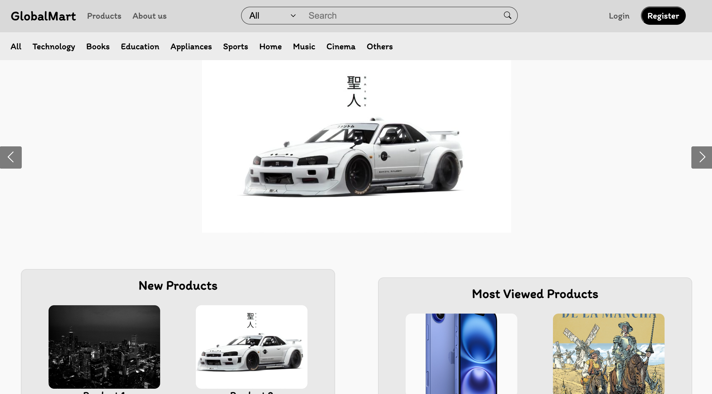

- **Pantalla de productos**

    - En esta captura se pueden observar los productos que han sido subidos por las compañías y aceptados por los administradores, esta pantalla la verás si eres un usuario sin iniciar sesión o un comprador.
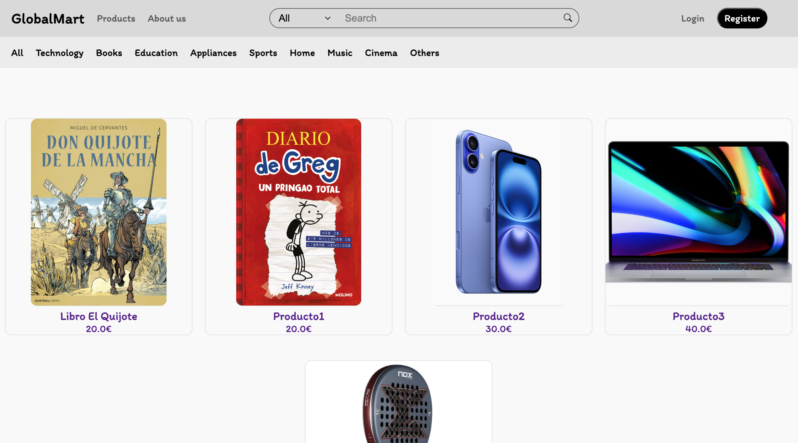

- **Pantalla About us**

    - En esta captura se puede observar información sobre nuestra empresa, en esta página nos introducimos a nosotros mismos indicando nuestras aficiones y lo que nos motiva a mejorar nuestra web.
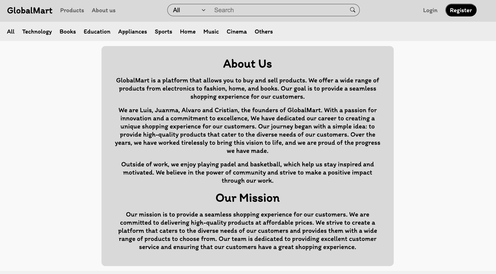

- **Pantalla de opciones para indentificarse**

    - Esta pantalla es un "pop-up" en el que solicita al usuario que se quiere identificar si desea utilizar un formulario en el que introducir su información para iniciar sesión / registrarse o si desea utilizar la tecnología complementaria de google para iniciar sesión con esta plataforma.

- **Pantalla de registro/inicio de sesión**

    - Esta pantalla es un "pop-up" en el que se solicita al usuario que se registre / inicie sesión mediante un formulario, además a través de este formulario el usuario podrá indicar si quiere una cuenta de compañía (para subir productos a la venta) o de comprador (para comprar los productos que suben las compañías).
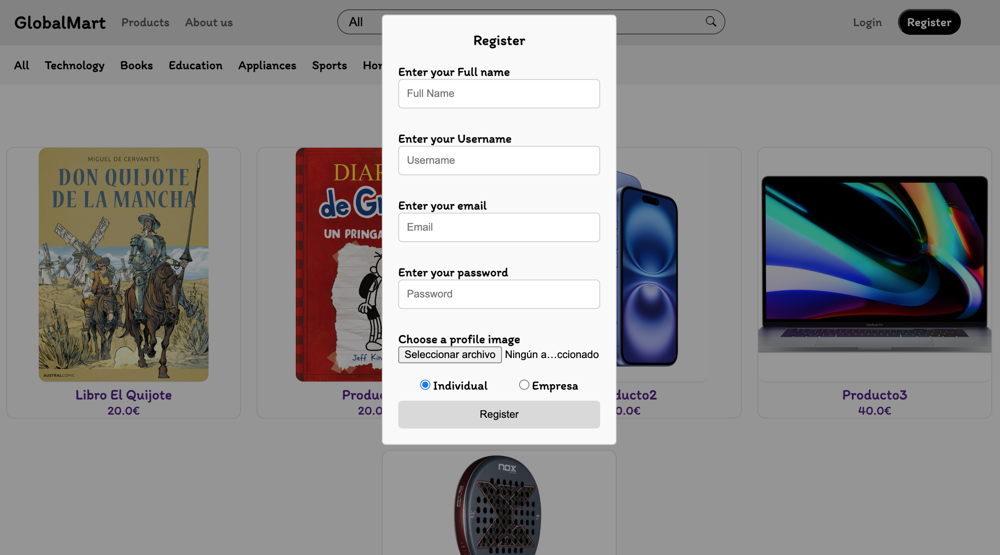

- **Pantalla de carrito**

    - En esta captura se puede observar el carrito del usuario que está registrado. Esta pantalla solo se puede observar si el usuario que ha iniciado sesión es un comprador.
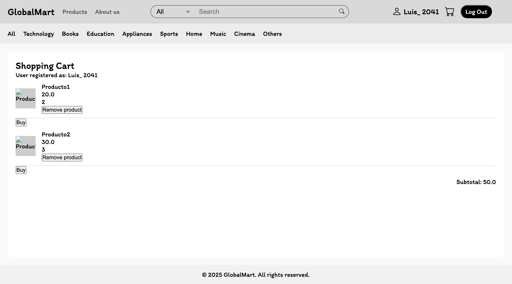

- **Pantalla de información de la cuenta**

    - En esta captura se puede observar la información de la cuenta que ha iniciado sesión.
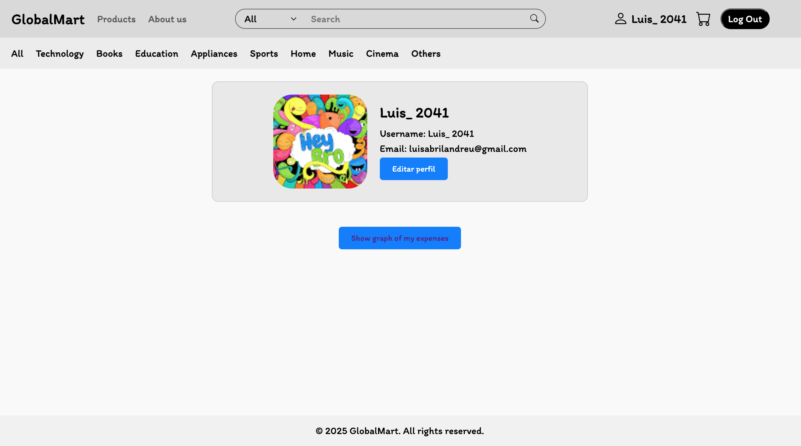

- **Pantalla de creación de nuevo producto**

    - En esta captura se puede observar un formulario que una compañía puede rellenar para la subida de un nuevo producto.
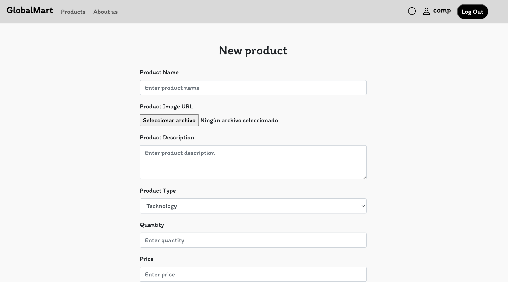

- **Pantalla de página de administrador**

    - En esta captura se observa la funcionalidad especial del administrador, la cual es aceptar o rechazar subidas de nuevos productos que quieres hacer las compañías.
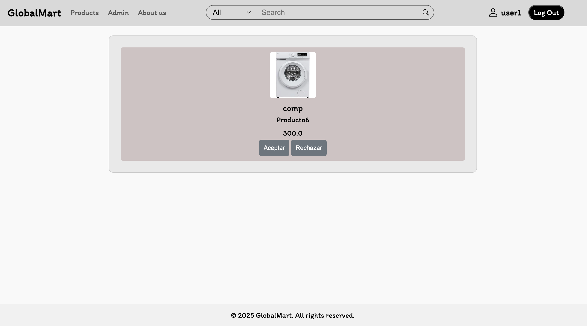

- **Pantalla de información detallada de un producto**

    - En esta captura se puede observar la información detallada de un producto, incluyendo las reviews de otros usuarios sobre ese mismo producto.
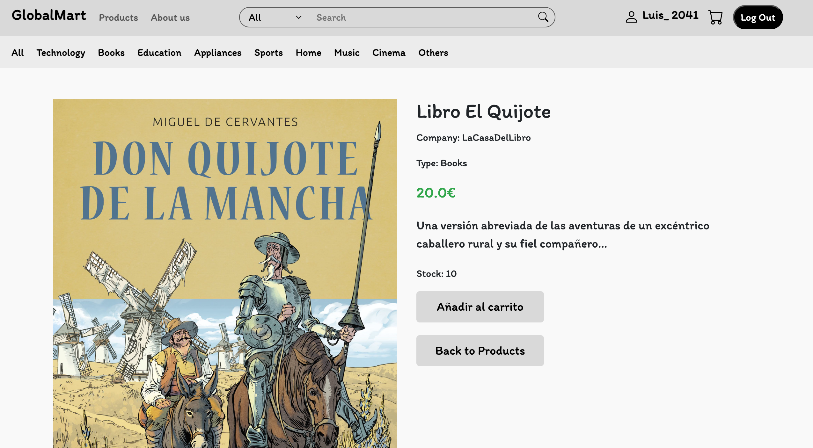
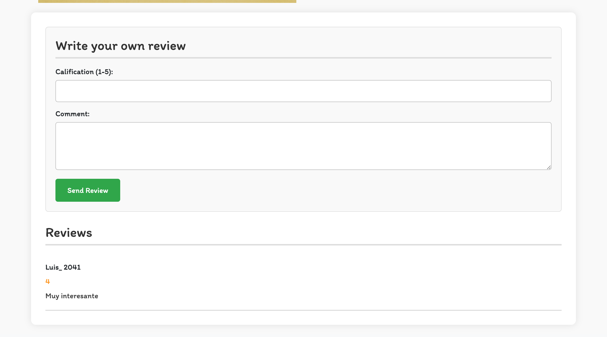

- **Diagrama de navegación de GlobalMart**

# Instrucciones de Ejecución

## Requisitos Previos  
Antes de ejecutar la aplicación, asegúrate de tener instalados los siguientes componentes:  

- **Java** (versión 21)  
- **Apache Maven** (versión 3.8 o superior)  
- **MySQL Server** (versión 8.0 o superior)  
- **Git**  

---

## Clonar el repositorio  
- Ejecuta el siguiente comando en la terminal para descargar el código fuente:

git clone <URL_DEL_REPOSITORIO>
cd <NOMBRE_DEL_PROYECTO>

---

## MYSQL
- Iniciar Sesión:

mysql -u root -p 1234password?

- Crear la base de datos:

CREATE DATABASE global_mart;

- Salir de MYSQL:

EXIT;

---

## Construir y Ejecutar la aplicación
- Construir la aplicación:

mvn clean package

- Ejecutar la aplicación:

java -jar target/webapp6.jar

---

## Acceder a la aplicación
Acceder en el navegador a la url: https://localhost:8443

---

**Diagrama de relaciones de base de datos**
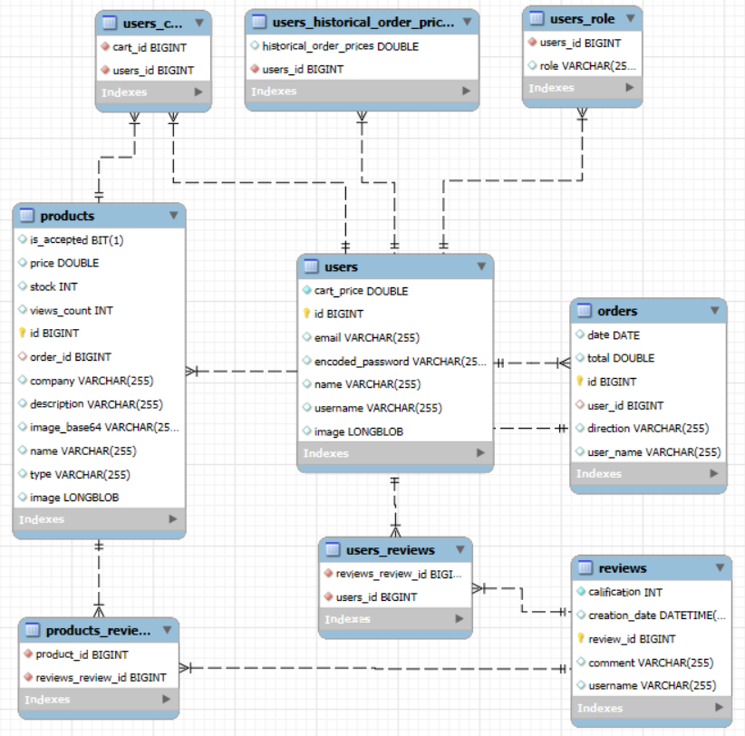
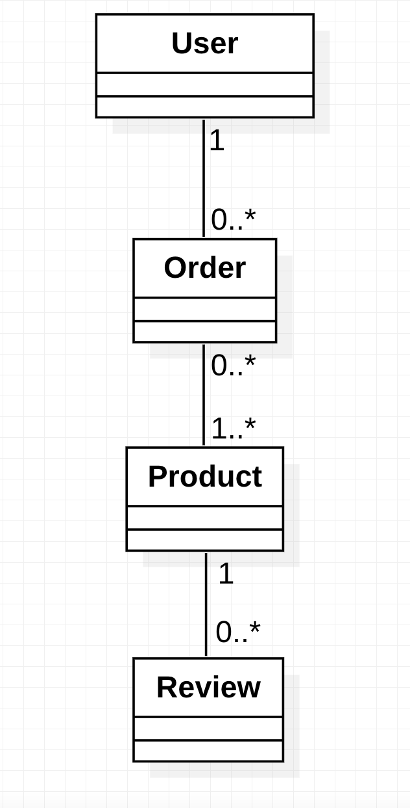

**Diagrama de relaciones de clases**
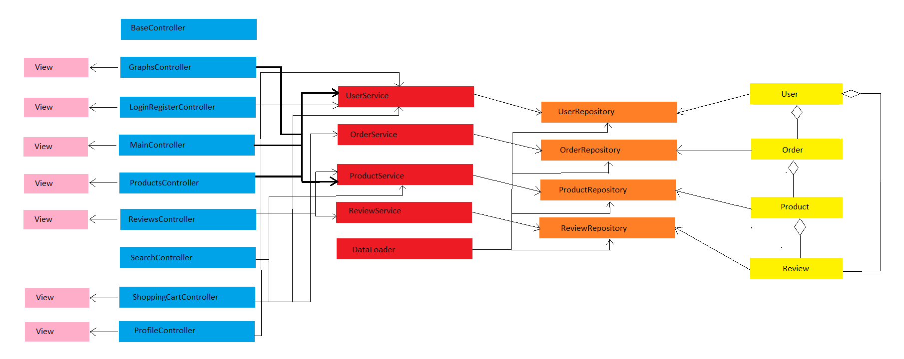

## Commits de Mayor Importancia Realizados

### Luis

| **Descripción** | **Link**     |
|-----------------|--------------|
| Commit 1        | [Link 1]     |
| Commit 2        | [Link 2]     |
| Commit 3        | [Link 3]     |
| Commit 4        | [Link 4]     |
| Commit 5        | [Link 5]     |

### Cristian

| **Descripción** | **Link**     |
|-----------------|--------------|
| Commit 1        | [Link 1]     |
| Commit 2        | [Link 2]     |
| Commit 3        | [Link 3]     |
| Commit 4        | [Link 4]     |
| Commit 5        | [Link 5]     |

### Juan Manuel

| **Descripción** | **Link**     |
|-----------------|--------------|
| Commit 1        | [Link 1]     |
| Commit 2        | [Link 2]     |
| Commit 3        | [Link 3]     |
| Commit 4        | [Link 4]     |
| Commit 5        | [Link 5]     |

### Álvaro

| **Descripción** | **Link**     |
|-----------------|--------------|
| Commit 1        | [Link 1]     |
| Commit 2        | [Link 2]     |
| Commit 3        | [Link 3]     |
| Commit 4        | [Link 4]     |
| Commit 5        | [Link 5]     |

## Ficheros de Mayor Participación

### Luis

| **Descripción** | **Link**     |
|-----------------|--------------|
| Fichero 1       | [Link 1]     |
| Fichero 2       | [Link 2]     |
| Fichero 3       | [Link 3]     |
| Fichero 4       | [Link 4]     |
| Fichero 5       | [Link 5]     |

### Cristian

| **Descripción** | **Link**     |
|-----------------|--------------|
| Fichero 1       | [Link 1]     |
| Fichero 2       | [Link 2]     |
| Fichero 3       | [Link 3]     |
| Fichero 4       | [Link 4]     |
| Fichero 5       | [Link 5]     |

### Juan Manuel

| **Descripción** | **Link**     |
|-----------------|--------------|
| Fichero 1       | [Link 1]     |
| Fichero 2       | [Link 2]     |
| Fichero 3       | [Link 3]     |
| Fichero 4       | [Link 4]     |
| Fichero 5       | [Link 5]     |

### Álvaro

| **Descripción** | **Link**     |
|-----------------|--------------|
| Fichero 1       | [Link 1]     |
| Fichero 2       | [Link 2]     |
| Fichero 3       | [Link 3]     |
| Fichero 4       | [Link 4]     |
| Fichero 5       | [Link 5]     |
